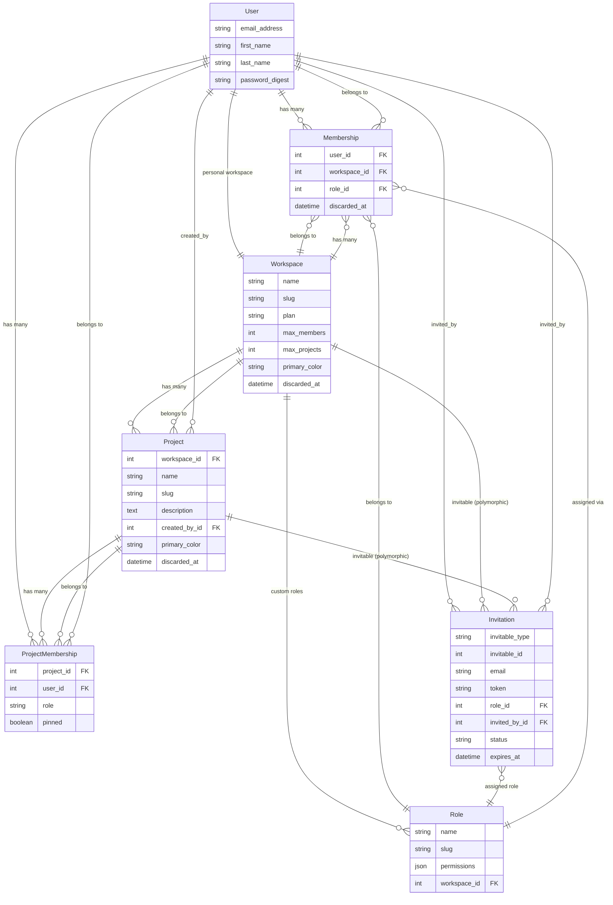
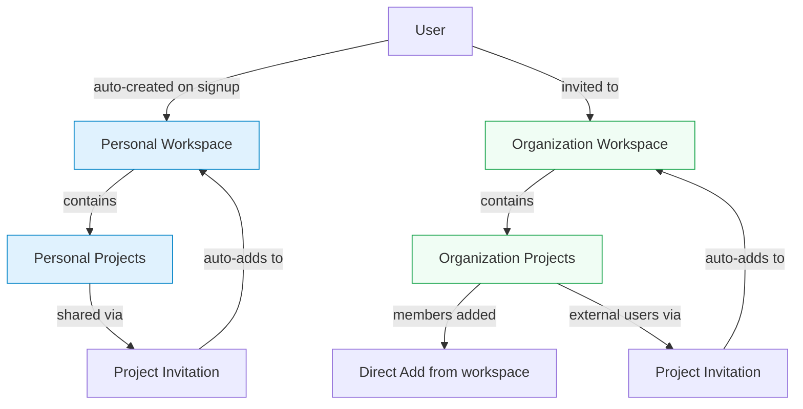
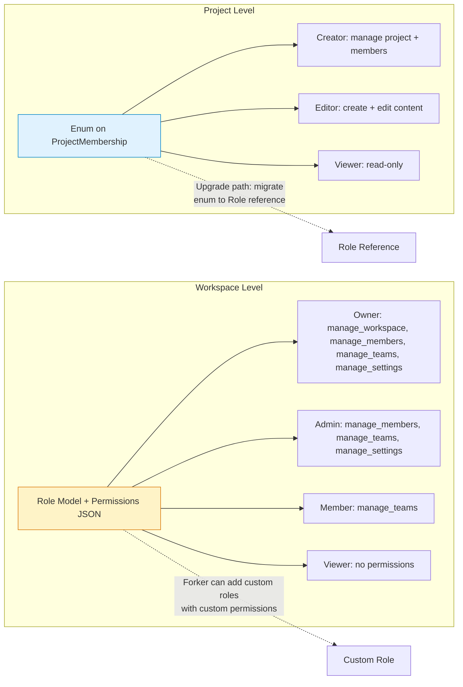
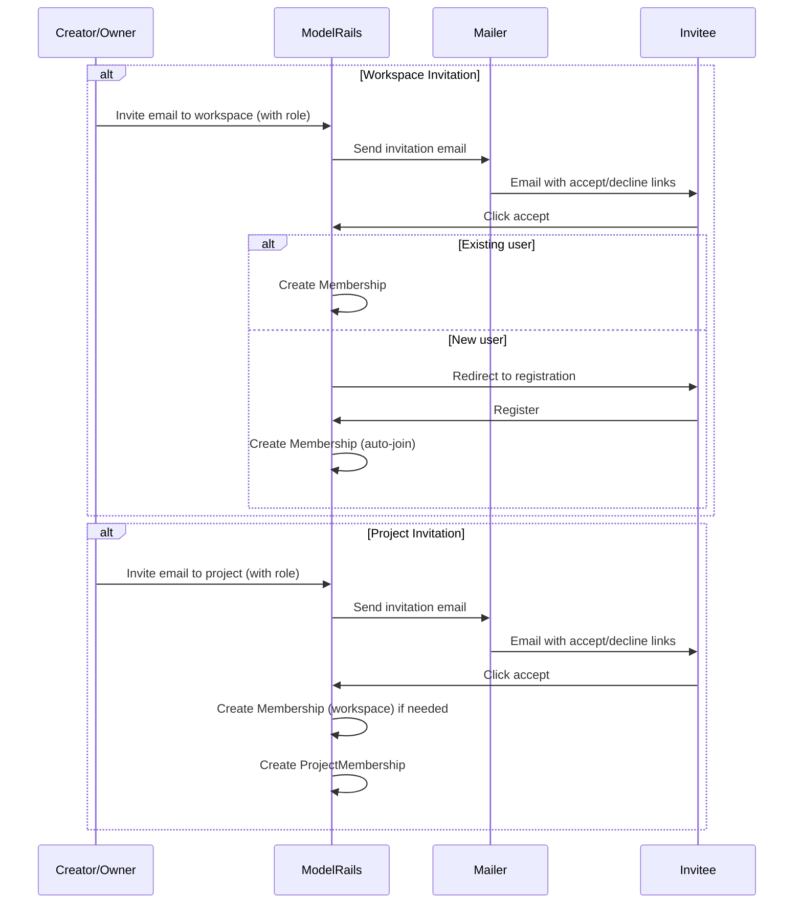
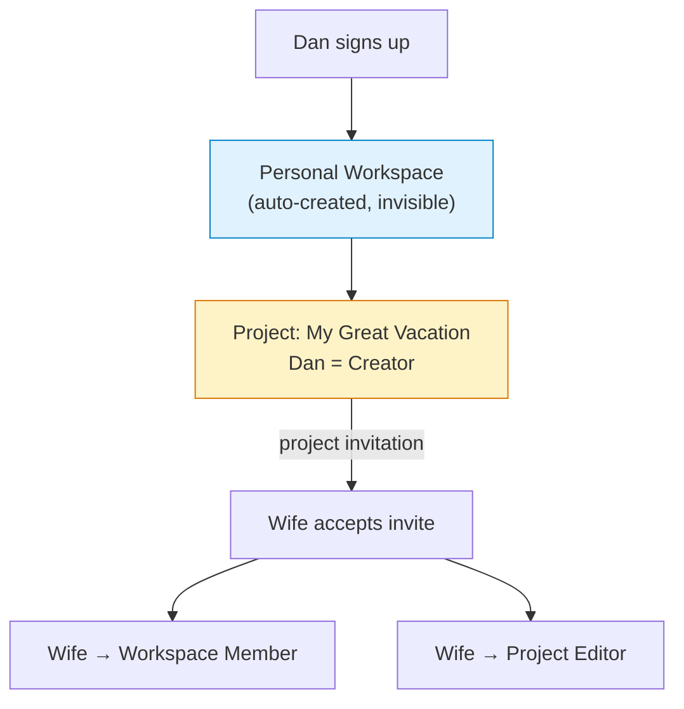
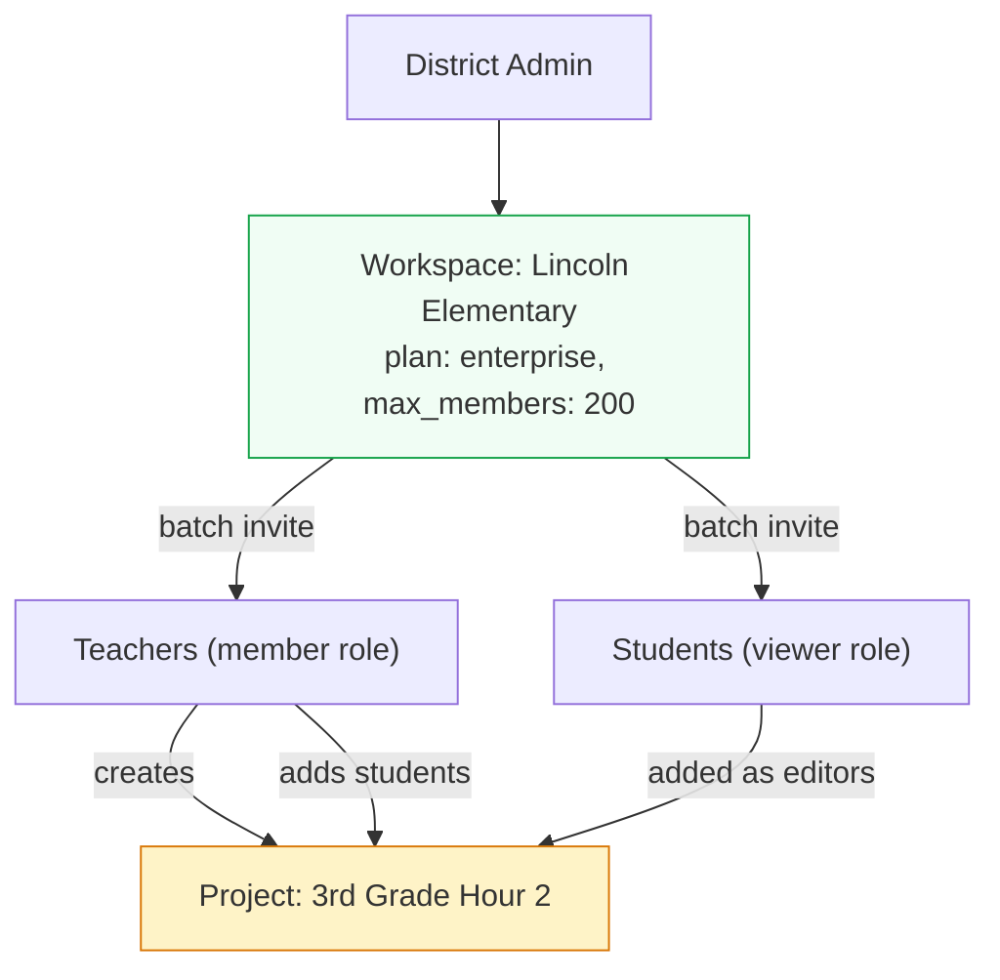
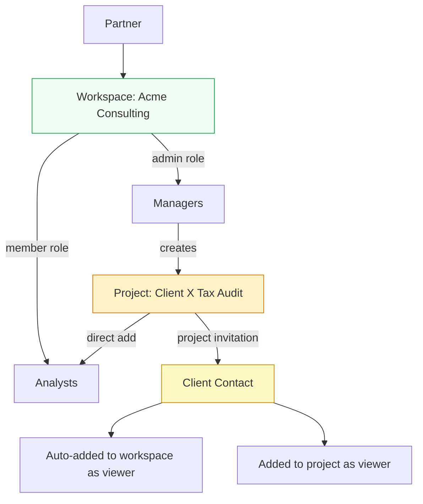
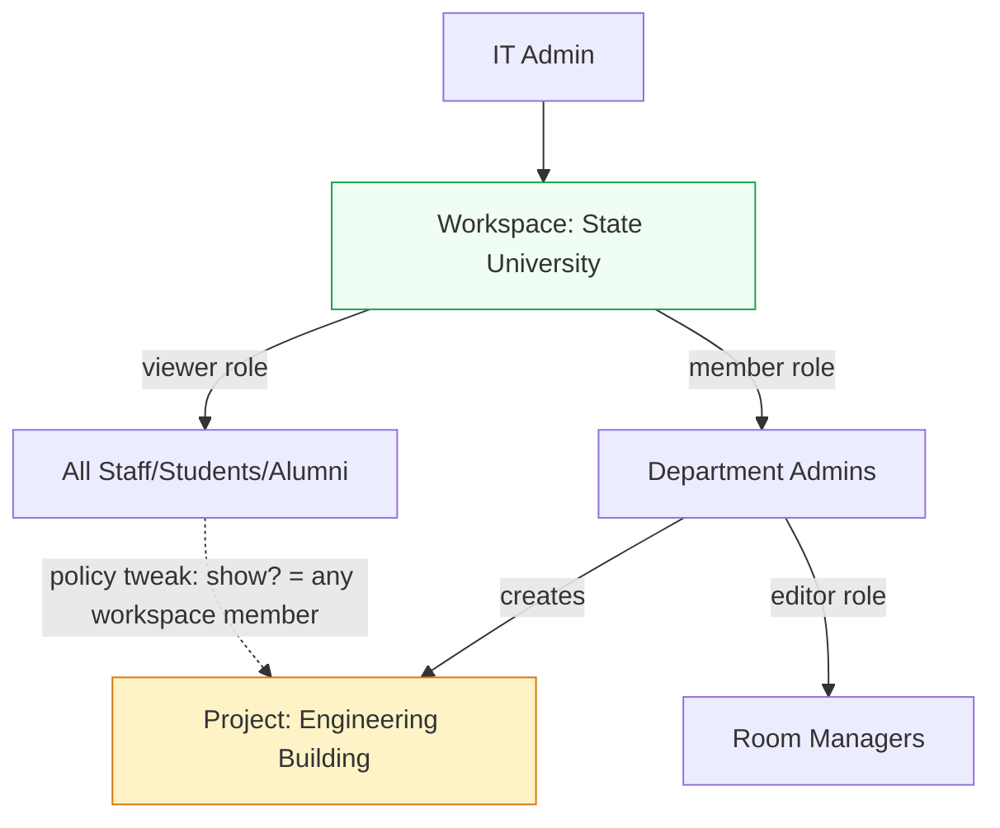
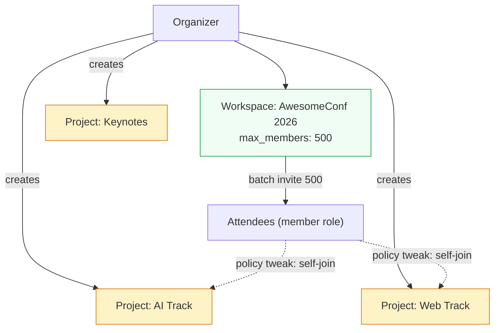
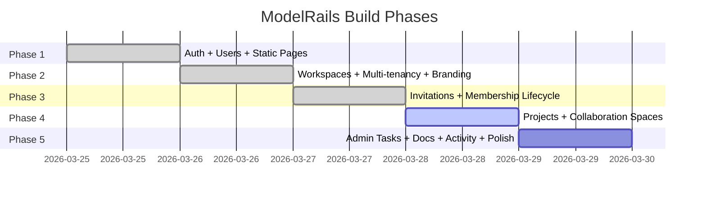

# ModelRails Architecture Review — Phase 4 Design Validation

**Date:** 2026-03-26
**Purpose:** Validate the workspace + project architecture against real-world application scenarios

---

## 1. Core Data Model

### Entity Relationship Diagram

### Conceptual Hierarchy

### Authorization Model

### Invitation Flow

---

## 2. Key Design Decisions

| Decision | Choice | Rationale |
|----------|--------|-----------|
| **Workspace** | Organizational boundary | Billing, roles, permissions, member management |
| **Project** | Collaboration boundary | Who works together on what, ad-hoc, purpose-driven |
| **Personal workspace** | Auto-created on sign-up | Individual users get a home without organizational friction |
| **Workspace roles** | Role model + permissions JSON | Forker-extensible via seeds, Pundit checks permission strings |
| **Project roles** | Enum (creator/editor/viewer) | Simple, clear mental model. Documented upgrade path to Role model |
| **Project invitations** | Polymorphic, auto-adds to workspace | One-step sharing, no "join org first" friction |
| **Soft delete** | Discardable concern (discarded_at) | One pattern everywhere, simple concern |
| **Cascade** | Workspace membership discard → destroy project memberships | Direct method call in deactivate!, no callback framework |

---

## 3. Scenario Validation

### Scenario 1: SonicPics — Individual User

**Context:** Dan signs up to make vacation slideshows. Wants to share with his wife.

| Step | Works? |
|------|--------|
| Sign up → auto workspace | Yes |
| Create project | Yes |
| Share with wife (project invitation) | Yes |
| Wife edits slideshow | Yes (editor role) |

**Gaps:** None for this scenario.

---

### Scenario 2: SonicPics — School/Enterprise

**Context:** Lincoln Elementary purchases a license. Teachers create class projects.

| Step | Works? |
|------|--------|
| District creates workspace | Yes |
| Batch invite teachers/students | Yes |
| Teacher creates project | Yes |
| Students collaborate | Yes (editor role) |
| Student submits to teacher | No (resource-level, deferred) |
| Student shares with classmate | No (resource-level, deferred) |

**Gaps:** Resource management and submission workflows (deferred to post-Phase 5).

---

### Scenario 3: Consulting Firm

**Context:** Acme Consulting manages client engagements with external client contacts.

| Step | Works? |
|------|--------|
| Create workspace | Yes |
| Invite staff with roles | Yes |
| Create project | Yes |
| Add client as viewer | Yes (project invitation) |
| Client sees only their project | Yes (project membership scopes access) |
| Client isolated from other workspace data | Partial (they're a workspace viewer) |

**Gaps:** External guest isolation — client can see workspace member list. Forker can restrict with a "guest" workspace role that has no workspace-level permissions.

---

### Scenario 4: Classroom Database (University)

**Context:** Room/equipment directory. Everyone can browse, departments manage their buildings.

| Step | Works? |
|------|--------|
| University workspace | Yes |
| Bulk member add | Yes |
| Department creates building project | Yes |
| Room managers edit | Yes (editor role) |
| Everyone can browse | One-line policy change (`show?` → `membership.present?`) |

**Gaps:** One policy line change for public-within-workspace projects.

---

### Scenario 5: Convene (Conference App)

**Context:** AwesomeConf 2026 with 500 attendees, sessions, bio sharing.

| Step | Works? |
|------|--------|
| Create conference workspace | Yes |
| Batch invite attendees | Yes |
| Create session tracks as projects | Yes |
| Attendees join sessions | Policy tweak (self-add to open projects) |
| Bio card creation/sharing | No (resource-level, deferred) |
| Schedule = list of projects you're in | Derivable from project memberships (view concern) |

**Gaps:** Self-join (policy tweak). Bio/profile sharing (deferred).

---

### Scenario 6: Creative Agency

**Context:** Agency manages campaigns for clients.

| Step | Works? |
|------|--------|
| Agency workspace | Yes |
| Campaign projects | Yes |
| Client as viewer | Yes (project invitation) |
| "Can comment but not edit" | No (resource-level permission, deferred) |

---

### Scenario 7: Open Source Project

**Context:** Organization with repos/initiatives.

| Step | Works? |
|------|--------|
| Organization workspace | Yes |
| Repo/initiative projects | Yes |
| Maintainer/Contributor/Triager roles | Enum names don't match, but permissions do |
| Custom role names | I18n customization (easy) or Role model upgrade (documented) |

---

## 4. What Phase 4 Delivers

### Included

1. **Project model** — Tenanted, Discardable, slug, logo + OKLCH color, max_projects enforcement
2. **ProjectMembership** — enum roles (creator/editor/viewer), pinned boolean
3. **Personal workspace** — auto-created on User sign-up
4. **Project-level invitations** — polymorphic Invitation reuse, auto-adds to workspace
5. **Pundit policies** — permission checks via enum, workspace owner can delete any project
6. **Rename** max_teams → max_projects
7. **Cascade** — workspace membership discard destroys project memberships

### Forker's Job (Not Starter Kit)

- External guest isolation (project-only access)
- Self-join for open projects (policy tweak)
- Public-within-workspace projects (policy tweak)
- Custom project role names (I18n or Role model upgrade)
- Resource-level sharing/commenting/submission workflows
- All resource types (documents, links, notes, etc.)

### Documented Upgrade Path

- **Enum → Role model for project roles:** Migration adds `role_id` to `project_memberships`, seeds custom roles, updates policies. Documented in README.

---

## 5. Phase Summary (All Phases)

| Phase | Tag | Examples | Coverage |
|-------|-----|----------|----------|
| 1 — Auth + Users | v0.1.0 | 77 | 89% |
| 2 — Workspaces | v0.2.0 | 133 | 89.7% |
| 3 — Invitations | v0.3.0 | 217 | 92.3% |
| 4 — Projects | v0.4.0 | TBD | TBD |
| 5 — Admin/Polish | v0.5.0 | TBD | TBD |
