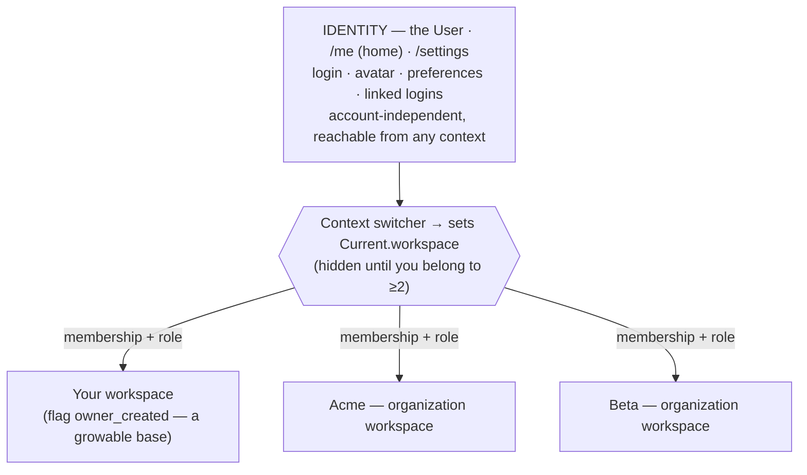
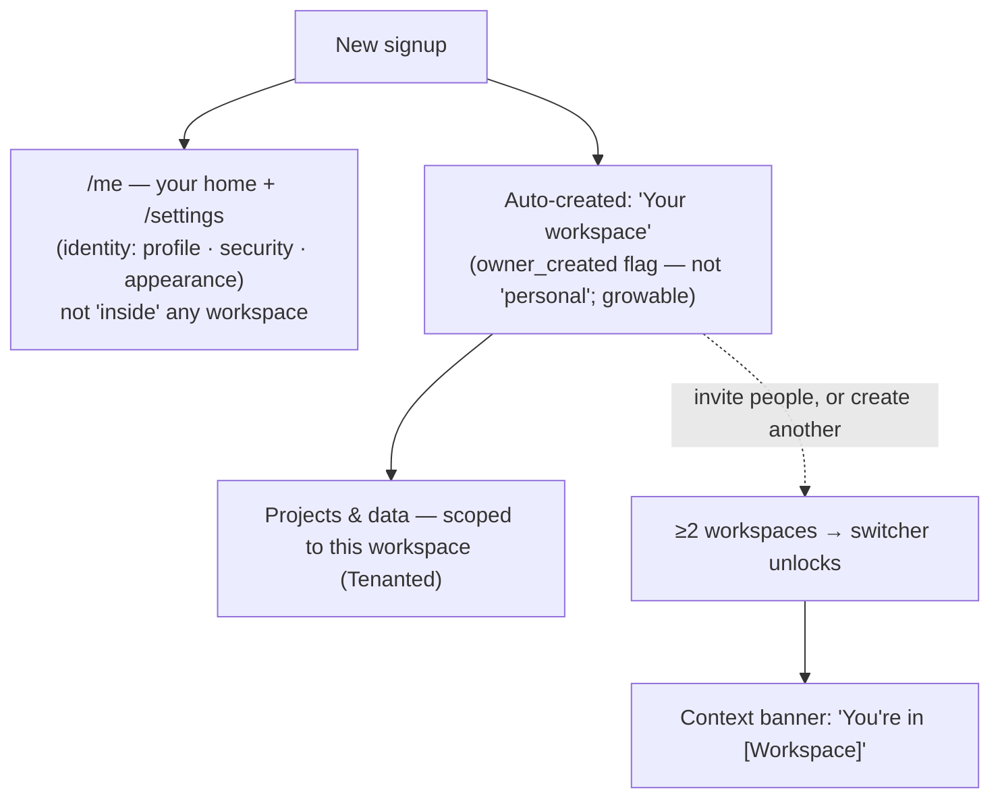
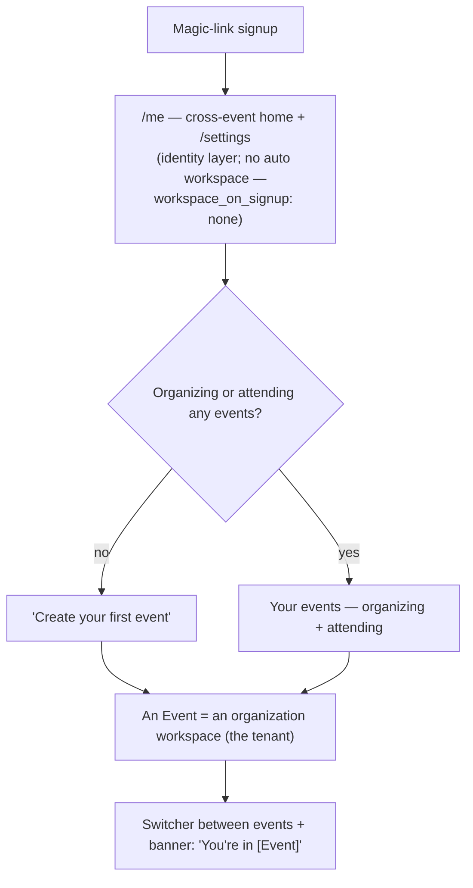

# Identity & Account Model Clarity — Design Spec

**Status:** Draft for review (not yet an implementation plan)
**Date:** 2026-06-18
**Scope:** modelrails_base (template); hallwaytrack as the worked fork
**Direction (decided):** Identity is a first-class layer, distinct from tenants. This **supersedes** the "personal-workspace-as-context / polymorphic Profile" framing in `working_files/multi-tenant-ia-brief.md` — while **harvesting** that brief's orthogonal implementation guidance (switcher component, OKLCH personal-context tokens, a11y, query perf, auth defense).
**Origin:** 6-voice review panel — DHH, Dave Thomas, Chris Oliver, Aaron Patterson, Jason Fried; synthesized via Sandi Metz (cost of change) + Jim Weirich (clarity). Companion flow diagrams: `working_files/onboarding_diagrams.md`.

---

## 1. Problem

The template is already a GitHub-style multi-tenant system and it is **data-integrity-sound** — verified, not assumed: `User` is the identity; `Workspace` is the tenant (a `personal:` boolean marks the auto-created one); `Membership` joins them with a `Role`; `users.personal_workspace_id` carries a partial-unique index; signup/admit races are safe. The panel was unanimous: **the model is right; do not re-architect it.**

What's wrong is **legibility**, on three axes:

1. **The names lie.** A "personal" workspace can grow members (so it isn't personal). `TENANCY_ONBOARDING=none` reads as "no tenancy" though the app is *always* multi-tenant. "Account" means two different things (the `Account::` settings namespace vs. a GitHub-style tenant).
2. **The model is undocumented.** Every reviewer independently noted: the structure is correct but *invisible* to anyone forking it. There is no doc that names the tiers.
3. **The presentation conflates identity with tenancy.** The prior IA Brief surfaced user settings *inside* a "personal workspace" context. We are choosing the opposite: identity is its own layer.

## 2. The decision

**Three legible tiers.** Identity is account-independent; tenancy is where collaboration and scoped data live.

| Tier | Entity | Where you reach it | What it holds |
|---|---|---|---|
| **Identity** (the human) | `User` | `/me` (home) + `/settings` | login, avatar, preferences, linked logins — *account-independent* |
| **Your workspace** (your own tenant) | `Workspace` (auto-created, growable) | the switcher; default landing in solo apps | your individual scoped data; can grow into a team |
| **Organization workspace** (shared tenant) | `Workspace` | the switcher | a team's scoped data, many members + roles |

A **context switcher** sets `Current.workspace`. Identity (`/me`, `/settings`) is reachable from *any* context and belongs to none of them.

This **supersedes** three choices in the IA Brief:

- ~~"No single Account Settings surface — don't design one"~~ → **`/me` is the identity home.**
- ~~Polymorphic "Profile" (your identity in personal, the workspace's in org)~~ → **identity settings ≠ workspace settings; no shared label.**
- ~~Keep `/account/*` URLs as the personal-context frame~~ → **`/account/*` → `/me` + `/settings`** (Phase 2; see §7).

## 3. What we KEEP from the IA Brief (orthogonal, still applies)

The Brief's *philosophy* is superseded; its *engineering* is not. These survive intact and feed the eventual switcher work:

- **One switcher, in the header dropdown** — over a shared `WorkspaceChip`; person-vs-org differentiation via **shape, not color alone** (WCAG 1.4.1). (The Brief's *second* variant — a switcher in the settings sidebar — is **dropped**: under identity-as-layer, `/settings` is account-independent, so there's nothing to switch there.) The switcher lists **all** your workspaces (your own + orgs) and **collapses entirely when you have only one**.
- **OKLCH token ramp for "your workspace"** — a deliberate desaturated ramp so it doesn't look like "an org that forgot to pick a color."
- **A11y:** `aria-live` context-change announcement; focus stays on the switcher after selection; `<h1>`/`<title>` always name the active context.
- **Query perf:** a single preloaded switcher scope passed as a local; Bullet regression spec asserting ≤2 workspace queries per render; `personal?` stays a column read.
- **Auth defense:** re-validate `Current.workspace` against `current_user.workspaces` every request; controller `authorize` is the source of truth, sidebar visibility is decoration.
- **No `SidebarPolicy`** — `nav_item_if_permitted` calls the destination controller's own policy method; demotion-while-viewing redirects gracefully.

## 4. Canonical vocabulary

| Concept | Today | After | Why |
|---|---|---|---|
| The human / login | `User`; settings at `/account/*` | `User`; home `/me`, settings `/settings` | identity is its own layer; "account" stops doubling as a tenant word |
| The tenant container | `Workspace` | `Workspace` (unchanged) | one entity for your-own + orgs; the model is right |
| Your auto-created workspace | `personal: true`; UI "personal workspace" | flag → `owner_created`; UI **"your workspace"** | it can grow → "personal" lies |
| A multi-member tenant | non-`personal` `Workspace` | UI **"organization workspace"** | plain word; matches GitHub |
| Active-context selector | implicit | **"context switcher"** + a "You're in [X]" banner | make switches visible |
| Onboarding env var | `TENANCY_ONBOARDING=none` | `WORKSPACE_ON_SIGNUP=none` | the var now asks "which workspace at signup?" → `none` is honest; pairs with `SIGNUP_MODE` |
| Identity home + settings | `/account/*` | `/me` (home) + `/settings` (hub) | split is future-proof (home and settings can diverge). Move **cleanly now** — pre-launch means ~no emitted `/account/*` links to preserve, so no permanent redirects; a fork already in production adds *temporary* cutover redirects (see §5) |
| Identity controllers | `Account::` namespace | `Settings::` / `Identity::` *(Phase 2)* | churny rename; defer until it's touched |

## 5. The honest-naming pass (retire the lies)

1. **`personal:` flag → `owner_created`** (it marks "auto-created for one owner at signup," not "stays solo"). Column rename = a migration → **Phase 2**. The *user-facing word* ("your workspace," never "personal/account") ships in **Phase 1**.
2. **`TENANCY_ONBOARDING=none` → `WORKSPACE_ON_SIGNUP=none`.** Cheapest now — it shipped today (#343) and only the fork consumes it (Kent Beck: make the change while it's easy).
3. **`/account/*` → `/me` (home) + `/settings` (hub)** — Phase 2, moved **cleanly, no permanent redirects**. The only emitted-artifact risk is sent verification/confirmation emails that deep-link `/account/*` (e.g. `Account::ConnectedAccountsController#verify`) — empty at one pre-launch app, so nothing to preserve. Bank the clean structure now; forks built later inherit zero legacy. **A fork already in production** adds *temporary* cutover redirects at the move, then removes them once outstanding email links expire.

## 6. How it looks / feels after

### The model (every fork inherits this shape)

### modelrails_base — Solo-default (after)

### hallwaytrack — Workspace-optional (after)

The contrast is the point: **Solo-default auto-creates "your workspace"** as the base; **Workspace-optional (Hallway Track) creates none** — `/me` is the home and Events are the only tenants. Same identity layer; different tenant defaults, chosen by one config knob.

## 7. Phased scope (sequenced by cost — Sandi's lens)

**Phase 0 — Document (now, ~zero code churn, highest ROI).**
`app/docs/accounts-and-identity.md`: names the three tiers, the canonical vocabulary, and the switcher/identity split. This is the single artifact every reviewer asked for; it makes the existing correctness *visible* to forks.

**Phase 1 — Honest names + the identity home (cheap).**

- Rename `TENANCY_ONBOARDING` → `WORKSPACE_ON_SIGNUP` (do it while it's a 1-fork change).
- User-facing copy/i18n: "your workspace" + "organization workspace"; never "account" for a tenant.
- Surface `/me` as the identity home + a "You're in [X]" context banner.

**Phase 2 — Structural renames + the switcher (deferred; triggered).**

- `personal:` column → `owner_created` (migration; trigger: next time that area is touched).
- `/account/*` → `/me` + `/settings` (route move + redirects + fork sync; trigger: the switcher build).
- Build the switcher component (Brief's design), OKLCH "your workspace" tokens, the a11y live-region.
- Billing scope decision (per-account vs per-user — Chris); DB-level owner invariant (Aaron, when off SQLite / exposing admin SQL).

## 8. Non-goals

- **Not** re-architecting the data model — one `Workspace` for both flavors stays.
- **Not** capping "your workspace" at one member — it stays growable (panel 4–1). "Graduation" to an org is a transfer/scale path, not a new model.
- **Not** building billing — only *naming the decision* a fork must make.
- **Not** introducing per-workspace identity overrides (preferred names) — out of scope, designed if/when needed.

## 9. Resolved decisions (2026-06-18)

1. **Flag name:** `owner_created` — most honest (marks "auto-created for one owner at signup," not "stays solo").
2. **Env var:** `WORKSPACE_ON_SIGNUP` — pairs with `SIGNUP_MODE`; the var names the question, so `none` reads honestly.
3. **Identity URLs:** **split** — `/me` (home) + `/settings` (hub). Move **cleanly now, no permanent redirects** — at one pre-launch app there are ~no emitted `/account/*` links to preserve (revised from the first draft: the redirect only insures sent emails, which don't exist yet). A *production* fork adds temporary cutover redirects; the template carries none. Build the seam, defer the contents — `/me` may ship thin.
4. **Switcher:** **one switcher, header dropdown only** (the settings-sidebar switcher is dropped — `/settings` is account-independent). Lists all your workspaces (your own + orgs); collapses entirely when you have only one.

### Settings bifurcation (consequence of #4)

- **Identity settings** → `/settings` (Profile = you, Security, Appearance, Notifications). Account-independent, no switcher.
- **Workspace settings** → reached by switching to that workspace in the header, then its admin pages (Members, Invitations, branding, Limits). Per-tenant.

## Appendix — panel positions (one-liners)

- **DHH:** "Already GitHub-style and Rails-honest — ship the model, don't add an `Account` model, fix the naming in docs/copy."
- **Dave Thomas:** "Carves reality at the joints; the crisis is naming — separate identity from tenant, resolve the `Account::` collision."
- **Chris Oliver:** "Right target for a template, but document the intent; name the billing scope and the graduation path."
- **Aaron Patterson:** "Personal-as-real-tenant is integrity-safe; decide solo-capped vs growable and make the flag tell the truth."
- **Jason Fried:** "The plumbing's fine; don't ship the multi-account *UX* as the default — lead with presets, fix the words, add a context banner. Don't wrap identity in a fake workspace."
- **Sandi (synthesis):** keep the model; do the cheap naming/doc wins now; defer the churny renames until a feature earns them.
- **Jim (synthesis):** make the names tell the truth — `personal` and `none` both lie today.
